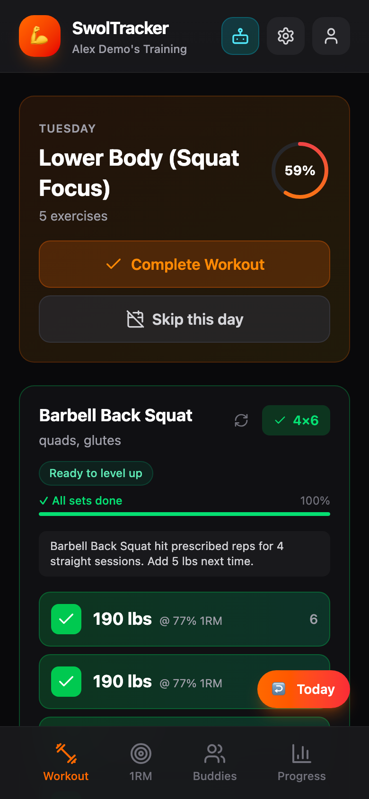
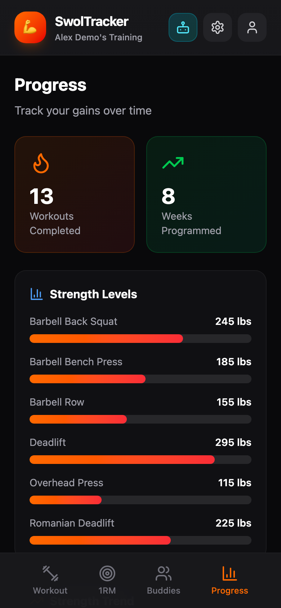
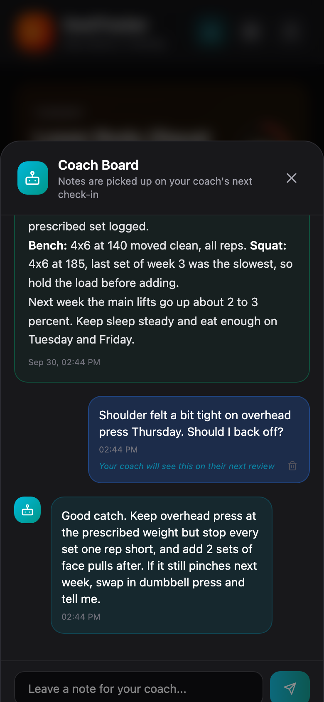
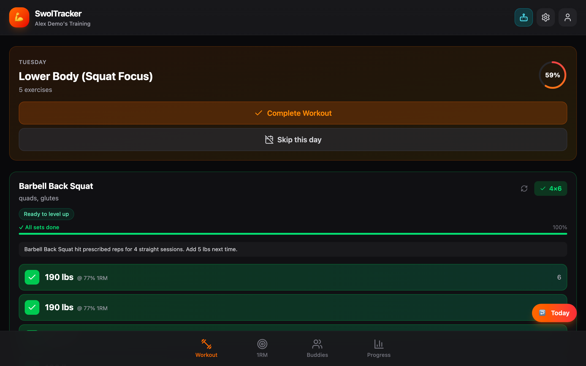

# SwolTracker

A workout tracker for lifters who want their program built from their own numbers. It generates
multi-week programs, sets every working weight from your 1RMs with progressive overload, and lets
you bring your own AI agent: connect Claude, Hermes or any MCP client and it can log sets, rewrite
your program and leave coaching notes on a shared Coach Board. It works offline at the gym and
installs as a PWA.

Live: https://swol-tracker.vercel.app

<p>
  
  
  
</p>



More: [maxes (mobile)](docs/screenshots/maxes-mobile.png),
[maxes (desktop)](docs/screenshots/maxes-desktop.png),
[progress (desktop)](docs/screenshots/progress-desktop.png),
[sign in](docs/screenshots/login-mobile.png).
The screenshots are a demo account with fake data.

## Features

- Today-first workout screen: log each set with actual weight and reps, one rest timer for the
  session (vibrates and beeps at zero), partial completion for half-finished days, and skip-a-day
  with a reason
- Weekly programs with percent-of-1RM weights, in multi-week blocks, stored per week as JSON
- AI program generation: first program at onboarding, next-week generation that pre-fills from your
  skips, notes and overload flags, and exercise swaps that respect your equipment
- Progressive overload flags (ready to increase, deload, stale) computed from your logs
- 1RM tracking with history, a percent quick-reference and strength levels
- Estimated-1RM PR moments: any set that clears your recorded max by 10 percent or more triggers
  confetti and a one-tap "save as new max". It never overwrites a max on its own.
- Progress: totals, strength levels and a per-lift estimated-1RM trend
- Coach Board: asynchronous notes between you and your agent, live through Supabase Realtime, with
  weekly reviews, program updates and post-workout notes the agent can read
- Offline set logging with a write queue that syncs when the connection returns
- Installable PWA with opt-in daily workout reminders (web push)
- Workout groups: a leader shares a program, members follow it, and a squad strip shows who
  trained today
- An admin panel for usage stats, LLM provider selection, prompt templates and error logs
- Google sign-in through Supabase Auth, with Row Level Security on every table

## Bring your own AI agent

SwolTracker is agent-native: the app is the data store and the display, and your own AI agent can
be the coach. The agent talks to a Model Context Protocol server built into the app.

```
 your agent (Claude Desktop, Hermes, OpenClaw, any MCP client)
        |  POST https://swol-tracker.vercel.app/api/mcp
        |  Authorization: Bearer swol_<key>
        v
  api/mcp.js   hash the key, find the user, check scopes,
               apply rate limits, write an audit row
        v
  @bot-native/sdk   dispatches to 44 tools in mcp/src/tools
        v
  Supabase (service role, every query scoped to your user id)
```

- **Keys.** Create one in onboarding (the Connect screen) or in Settings. The key is shown once and
  stored only as a SHA-256 hash. You can hold up to 5 active keys and revoke any of them. Settings
  also shows an activity log of recent tool calls (arguments are hashed, never stored).
- **Scopes.** `read`, `write:logs`, `write:program` and `coach`. Each tool declares the scope it
  needs, and a key without it gets a `forbidden` error.
- **Tools.** 44 in total: 24 read tools (today's workout, program, maxes, history, overload
  recommendations, weekly summary, Coach Board messages), 12 that write logs, maxes and profile
  fields (including natural-language logging such as "bench 3x8 at 185" and onboarding), 5 that
  write programs, 1 that posts a Coach Board note, and 2 exercise-name utilities.
- **Rate limits.** 500 requests per hour per user overall, with tighter limits on writes (100 an
  hour per category) and on program generation and saves (20 an hour each).
- **Agent guide.** [`SKILL.md`](SKILL.md) tells an agent how to use the tools and what to say. It is
  served at `/api/mcp/skill`. `/api/mcp/context` returns a compact state bundle in one call.
- **Public OpenAPI.** The tool catalog is at
  [`/api/mcp/openapi`](https://swol-tracker.vercel.app/api/mcp/openapi) (OpenAPI 3.1, generated
  from the tools' schemas and scopes). It needs no key, since tool shapes are not secret.

The Connect screen produces this client config, which you paste into your agent:

```json
{
  "swoltracker": {
    "url": "https://swol-tracker.vercel.app/api/mcp",
    "headers": { "Authorization": "Bearer swol_<your key>" }
  }
}
```

## Tech stack

React 18 and Vite (JavaScript), Tailwind CSS v4, `react-router-dom`, Supabase (Postgres, Auth, RLS,
Realtime), Vercel serverless functions, a TypeScript MCP package, the `@bot-native/sdk` (vendored),
Zod, Vitest, ESLint, Knip, GitHub Actions, npm.

## Architecture

The web app reaches the database only through repositories, composed into one `db` object.
Pure logic that both the web app and the MCP server need (week math, exercise aliases, estimated
1RM) lives once in `shared/` and is tested against both. LLM calls from the browser go through an
authenticated proxy at `/api/llm`, so no provider key ever reaches client code. The MCP endpoint
uses the service role, so each tool scopes every query to the authenticated user itself.

See [docs/architecture.md](docs/architecture.md) and the decision records:
[agent-native through MCP](docs/decisions/ADR-001-agent-native-mcp-with-bot-native-sdk.md),
[LLM proxy](docs/decisions/ADR-002-llm-calls-through-api-llm.md),
[repositories](docs/decisions/ADR-003-repositories-as-data-access-layer.md),
[web first, iOS paused](docs/decisions/ADR-004-web-first-ios-paused.md).
Current state and known gaps: [docs/status.md](docs/status.md). An Expo iOS app in `mobile/` is
paused.

## Local setup

Requires Node 20 or later and a Supabase project with the migrations in `migrations/` applied.

```sh
npm install
cd mcp && npm install && npm run build && cd ..   # api/ imports the compiled mcp/dist
# create .env.local with the public variables below
npm run dev
```

Open http://localhost:5173. The dev server runs the web app only; `/api/*` (AI generation, push,
MCP) runs on Vercel. Google sign-in redirects back to the page origin, so add your local origin to
the Supabase project's redirect URLs.

### Environment variables

| Name | Scope | Purpose |
| ---- | ----- | ------- |
| `VITE_SUPABASE_URL` | public | Supabase project URL |
| `VITE_SUPABASE_ANON_KEY` | public | Supabase anon key; RLS applies |
| `VITE_SENTRY_DSN` | public | Optional. Browser error reporting; inert when unset. Read at build time |
| `SUPABASE_URL` | server only | Optional. Project URL for functions; falls back to `VITE_SUPABASE_URL` |
| `SUPABASE_SERVICE_ROLE_KEY` | server only | Service role key for `api/` and the MCP server; bypasses RLS |
| `OPENAI_API_KEY` | server only | LLM provider key. Set at least one of the four provider keys |
| `ANTHROPIC_API_KEY` | server only | LLM provider key |
| `GEMINI_API_KEY` | server only | LLM provider key |
| `OPENROUTER_API_KEY` | server only | LLM provider key |
| `VAPID_PRIVATE_KEY` | server only | Web push private key; push and reminders are off without it |
| `CRON_SECRET` | server only | Bearer secret guarding `/api/cron/reminders` (Vercel sends it on cron calls) |
| `SENTRY_DSN` | server only | Optional. Server error reporting; inert when unset |
| `ALLOWED_ORIGINS` | server only | Optional. Comma-separated CORS allow list; defaults to the production origins and local Vite ports |
| `BOT_NATIVE_USER_ID` | server only | Optional. User id for the local stdio MCP server only (`mcp/.env`) |

## Scripts

| Command | What it does |
| ------- | ------------ |
| `npm run dev` | Vite dev server |
| `npm run build` | Production build into `dist/` |
| `npm run preview` | Serve the production build |
| `npm test` | Run all tests once (`npm run test:watch` for watch mode) |
| `npm run lint` | ESLint on `src` and `api` |
| `npm run knip` | Find unused files, exports and dependencies |
| `cd mcp && npm run build` | Compile `mcp/` and `shared/` to `mcp/dist/` |
| `npm run demo:seed` | Seed a demo account with fake data (needs `DEMO_EMAIL`, `DEMO_PASSWORD` and `--yes`) |
| `npm run screenshots` | Regenerate `docs/screenshots/` from the demo account with Playwright |

## Testing and CI

`npm test` runs 304 Vitest tests in 52 files: pure logic (week math, estimated 1RM, offline queue,
reminder rules), repositories against a mock client, and the MCP server (contract tests for every
tool family, scope enforcement, IDOR guards, the OpenAPI and skill endpoints). GitHub Actions runs
two workflows on every pull request and push to `main`: Test (lint, tests, MCP build, web build)
and Knip (unused code and dependencies). `main` deploys to Vercel on push, and the Vercel build
runs the tests too.

## Built with AI

Matt Merrill designed SwolTracker and owns its architecture, data model and engineering standards.
AI coding agents (Claude Code among them) write most of the code under his direction, held to the
rules in [AGENTS.md](AGENTS.md): he plans and reviews each change, and CI (lint, tests, Knip)
checks every pull request. Some older code predates those rules; [docs/status.md](docs/status.md) lists the
gaps and a refactor is planned.
